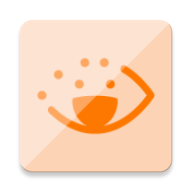

<picture style="display: inline-flex; align-items: center;">프로젝트 효자눈</picture>

## 프로젝트 설명
효자눈은 시각장애인, 저시력자, 그리고 점자를 배우고자 하는 비장애인을 위한 IoT 기반 점자 학습 솔루션입니다. 효자눈 팀은 시각장애인의 점자 문맹률이 95%에 이르는 사회적 문제를 해결하기 위해 STA+C 2019에 참가하여 6개월간 기획, 디자인, 개발 끝에 시제품을 완성했습니다.

## 앱 미리보기
<picture></picture>

## 소셜

### 기사
https://it.donga.com/29713/

https://www.etnews.com/20191121000205

https://biz.chosun.com/site/data/html_dir/2019/11/22/2019112202793.html

### 페이스북 페이지
https://www.facebook.com/ProjectHyojanoon?mibextid=ZbWKwL
